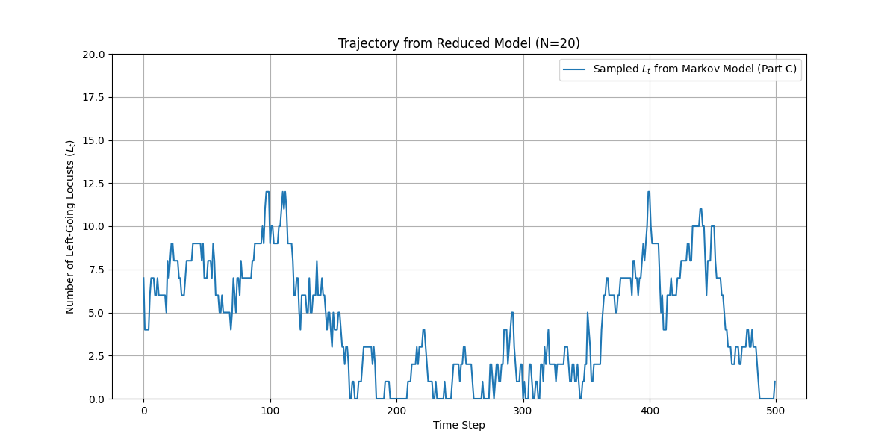
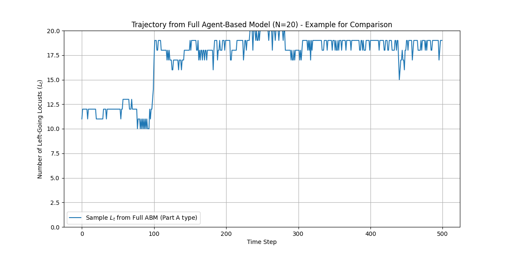

# Locust Swarm Simulation and Modeling

## Project Overview
This project simulates how locusts move and interact on a ring. Each locust can see its neighbors, change direction randomly, and react to others nearby. The goal is to understand the group’s behavior using simulations, data analysis, and a simple mathematical model.

The project has three main parts:
* **Task A**: Simulate one swarm and show how many locusts go left over time.
* **Task B**: Run many simulations to see how the number of left-going locusts ($L_t$) changes from one step to the next.
* **Task C**: Build a simple Markov model using the data from Task B and compare it to the detailed simulation.

## Files
* `locust_visualization.py`: Runs and shows one swarm (Task A).
* `multiple_runs.py`: Runs many swarms to collect data for Task B.
* `transition_count.py`: Uses Task B data to build and test the Markov model (Task C).

## Main Simulation Settings
* **Ring Size (`C`)**: 1.0
* **Locust Speed**: 0.001
* **Perception Range**: 0.045
* **Chance to Switch Direction**: 0.015
* **Number of Locusts**: 20
* **Steps per Run**: 500
* **Number of Runs (Tasks B & C)**: 1000

## Requirements
* Python 3.x
* NumPy
* Matplotlib

## How to Run and What You Get

### Task A: Single Simulation (`locust_visualization.py`)
1.  **Run**:
    ```bash
    python locust_visualization.py
    ```
2.  **What Happens**: Simulates 20 locusts for 500 steps.
3.  **Outputs**:
    * **On screen**: Animation of locusts on a ring and a plot of left-going locusts over time.
    * **Saved**: `task_A_ABM_locust_trajectory.png` (plot of left-going locusts).

    
    <div align="center"><em>Figure: Number of left-going locusts ($L_t$) over time in a single agent-based simulation (Task A).</em></div>

### Task B: Many Simulations (`multiple_runs.py`)
1.  **Run**:
    ```bash
    python multiple_runs.py
    ```
2.  **What Happens**: Runs 1000 simulations to see how $L_t$ changes. This takes a while.
3.  **Outputs**:
    * **On screen**: Heatmap showing how $L_t$ changes.
    * **Saved**: 
        * `task_B_transition_histogram.png` (heatmap)
        * `transition_matrix_A.npy` (raw data)

    
    <div align="center"><em>Figure: Heatmap of transitions from $L_t$ to $L_{t+1}$ across all simulations (Task B).</em></div>

### Task C: Markov Model (`transition_count.py`)
1.  **Run**:
    ```bash
    python transition_count.py
    ```
2.  **What Happens**:
    * Loads `transition_matrix_A.npy`
    * Calculates how likely $L_t$ changes to $L_{t+1}$
    * Runs a simple Markov simulation and compares it to the full simulation
3.  **Outputs**:
    * **On screen**: Two plots—one from the Markov model, one from the full simulation.
    * **Saved**:
        * `task_C_markov_model_trajectory.png`
        * `task_C_ABM_comparison_trajectory.png`

    
    <div align="center"><em>Figure: Sampled trajectory of $L_t$ from the Markov model built from Task B data (Task C).</em></div>

    
    <div align="center"><em>Figure: Sampled trajectory of $L_t$ from a full agent-based simulation for comparison (Task C).</em></div>

## Summary

- If the Markov model (Task C) looks like the full simulation (Task A), then $L$ (number of left-going locusts) is a good way to describe the group’s behavior.
- Differences show what details are lost when using a simpler model.
- The Markov model uses average transition rates, while the full simulation tracks every locust.
- Look for how often $L_t$ stays near $0$ or $20$, how fast it changes, and how much it fluctuates.
